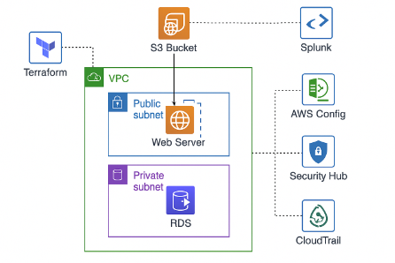

# AWS Detection & Response Framework

  This project is a modular, Terraform-based AWS security solution that integrates native AWS services to build a detection and response framework suitable for mid-market and enterprise environments.

  While a sample VPC environment with EC2 and RDS resources is deployed for testing, the focus of this project is the security services and automation foundation that will evolve into a reusable security framework.


   

  ## 🔐 Project Focus

  The core of this project is the orchestration of AWS security services:

  - **AWS Config** for resource inventory, compliance auditing, and change tracking
  - **AWS CloudTrail** for API activity logging across the account
  - **Amazon GuardDuty** for continuous threat detection and anomaly monitoring
  - **AWS Security Hub** for centralized compliance insights and standardized findings
  - **SNS** for alert distribution and notification
  - **Terraform** for modular, scalable infrastructure-as-code
  - **Third-party Security Tools** for a robust,secure environment

  Future enhancements will include **EventBridge-triggered Lambda** automation to remediate findings in real time (e.g., EC2 isolation, IAM access revocation).
  
  ## 🛠️ Modules

  - **security_services**: 
    - Enables GuardDuty (regional + multi-AZ support)
    - Configures AWS Config with global + regional resource recorders
    - Sets up CloudTrail logging to a secured S3 bucket
    - Optionally enables Security Hub and selected standards
  - **sns_alerts**: 
    - Creates SNS topic for notifications
    - Email-based alert subscription for findings and compliance events
  - **s3_logging**: 
    - Creates encrypted logging buckets for Config and CloudTrail
  - **network** *(demo/test only)*: 
    - VPC with public/private subnets, NAT, and route tables
  - **ec2** *(demo/test only)*: 
    - Bastion and Web Server with IAM roles and SSM support
  - **rds** *(demo/test only)*: 
    - Encrypted PostgreSQL instance with subnet group

  ## 🧪 Test Environment

  The EC2 and RDS deployments simulate a client workload for evaluating the security framework. You can replace or extend this with your actual infrastructure.

  - Bastion: SSH or SSM-based administration
  - Web Server: Public endpoint for HTTP access
  - RDS: Encrypted private database instance

  ## 📊 Security Hub Standards Enabled

  If `enable_securityhub = true`, the following standards are automatically enabled and findings routed to Security Hub:

  | Standard                                    | Description |
  |---------------------------------------------|-------------|
  | **CIS AWS Foundations Benchmark v1.2.0**    | Baseline security best practices |
  | **AWS Foundational Security Best Practices**| Service-specific security checks |
  | **PCI DSS v3.2.1**                          | Payment industry compliance mapping |

  Security Hub will auto-ingest findings from GuardDuty and AWS Config once the detector and recorder/delivery channels are properly initialized.

  ## ⚙️ Setup Instructions

  1. **Clone the repository**

     ```bash
     git clone https://github.com/Judewakim/AWS-Environment-with-Detection-and-Automated-Response.git
     cd AWS-Environment-with-Detection-and-Automated-Response
     ```

  2. **Initialize Terraform**

     ```bash
     terraform init
     ```

  3. **Configure your variables**

     Create or edit `terraform.tfvars`:

     ```hcl
     aws_region         = "us-east-1"
     key_name           = "your-key"
     ami_id             = "ami-xxxxxxx"
     instance_type      = "t3.micro"
     db_name            = "appdb"
     db_username        = "admin"
     db_password        = "SecurePassword123"
     enable_guardduty   = true
     enable_config      = true
     enable_securityhub = true
     ```

  4. **Deploy the stack**

     ```bash
     terraform apply
     ```

     Confirm when prompted.

  ## 🔁 Planned Automation

  EventBridge rules and Lambda functions will soon be added to act on specific Security Hub findings:

  - Isolate EC2 instances flagged as compromised
  - Revoke IAM credentials for suspicious activity
  - Notify security teams with actionable context
  - Automatically remediate failed Config rules

  ## 🧼 Cleanup

  Tear down the environment when finished:

  ```bash
  terraform destroy
